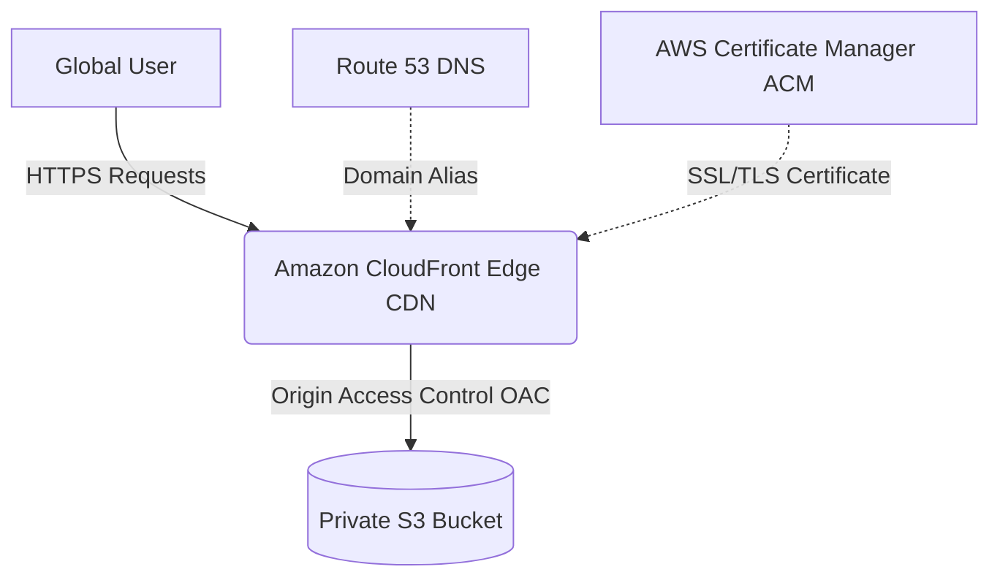

# ⚔️ Bleach: The Soul Society — S3 & CloudFront Distributed Tribute

[](https://opensource.org/licenses/MIT)
[](https://developer.mozilla.org/en-US/docs/Web/HTML)
[](https://developer.mozilla.org/en-US/docs/Web/CSS)
[](https://developer.mozilla.org/en-US/docs/Web/JavaScript)
[](https://aws.amazon.com/s3/)
[](https://aws.amazon.com/cloudfront/)

A visually stunning, high-performance tribute website dedicated to the legendary anime/manga series **BLEACH**. Built with semantic HTML5, modern CSS3 variables, and vanilla JavaScript, this project is specifically designed to showcase static hosting on **Amazon S3** and secure global content delivery via **Amazon CloudFront** CDN.

---

## 🌟 Key Features

*   **🌸 Rich Visuals & Aesthetics:** Striking typography using Google Fonts (Cinzel Decorative, Rajdhani) with a custom reiatsu-pulsing background Kanji container.
*   **🗡️ Interactive Gotei 13 Roster:** Hover-triggered character cards displaying profiles, Zanpakutō wielder specifications, and iconic quotes.
*   **📜 Animated Saga Timeline:** Dynamic timeline highlighting story arcs (Agent of the Shinigami to TYBW) animated smoothly using the browser's `IntersectionObserver` API.
*   **✨ Zanpakutō Blades Gallery:** Detailed grid detailing the command translations, users, and attributes of the legendary swords.
*   **💬 Dynamic Quote Carousel:** Auto-cycling quotes slide deck with manual dot-navigation selectors.
*   **📱 Responsive Layouts:** Flexible fluid-grid design using modern CSS flexbox/grid systems with fully collapsed mobile navigation triggers.

---

## 🏗️ Cloud Infrastructure Architecture

Deploying this tribute on AWS ensures absolute scalability, enterprise security, and sub-millisecond page delivery globally. The deployment pipeline leverages a secure private S3 bucket coupled with a CloudFront CDN endpoint.



### Infrastructure Benefits

1.  **Strict Security with OAC:** The S3 bucket remains completely private (blocking all public IP access). Access is restricted solely to the CloudFront distribution via **Origin Access Control (OAC)**.
2.  **Global Low Latency:** Edge servers cache the static HTML, CSS, and character assets locally to deliver them within milliseconds to visitors globally.
3.  **Automatic SSL Encryption:** AWS Certificate Manager (ACM) provisions free SSL certificates to enforce HTTP/S on custom domains.

---

## 📂 Repository Structure

The codebase is lightweight and written in optimized vanilla files:

*   **[index.html](file:///E:/claude1/index.html):** Structured semantic markup outlining the Soul Society sections.
*   **[style.css](file:///E:/claude1/style.css):** Visual design sheets using CSS custom variables, custom scrollbars, animations, diagonal dividers, and responsive layout styling.
*   **[script.js](file:///E:/claude1/script.js):** Orchestrates timeline Intersection Observers, interactive mobile menu toggles, and quotes carousel intervals.
*   **[assets/](file:///E:/claude1/assets):** Media assets folder containing custom logo branding and high-res character cards portraits.

---

## 🚀 Local Setup

To preview or modify the web app locally:

1.  **Clone the Repository:**
    ```bash
    git clone https://github.com/koriaryan1432/Cloudfront-S3.git
    cd Cloudfront-S3
    ```
2.  **Run Locally:**
    Since this is a static webpage, you can open [index.html](file:///E:/claude1/index.html) directly in any web browser. For a local web server experience, run one of the following commands:
    *   **Node (npx):** `npx serve .`
    *   **Python:** `python -m http.server 8000`
3.  **Access Page:**
    Open http://localhost:3000 (npx) or http://localhost:8000 (Python).

---

## ☁️ AWS Cloud Deployment Guide

Follow these steps to deploy the website to AWS using S3 and CloudFront:

### Step 1: Prepare the S3 Bucket
1.  Open the **Amazon S3 Console** and click **Create bucket**.
2.  Provide a name (e.g., `bleach-tribute-bucket`) and select your preferred AWS Region.
3.  Keep **Block all public access** checked (we will allow access *only* through CloudFront).
4.  Upload the files: [index.html](file:///E:/claude1/index.html), [style.css](file:///E:/claude1/style.css), [script.js](file:///E:/claude1/script.js), and the [assets/](file:///E:/claude1/assets) folder to the root of the bucket.

### Step 2: Create the CloudFront Distribution
1.  Open the **Amazon CloudFront Console** and click **Create distribution**.
2.  Under **Origin domain**, select your newly created S3 bucket.
3.  For **Origin access**, select **Origin access control settings (recommended)**:
    *   Click **Create control setting**, keep defaults, and click **Create**.
4.  Under **Viewer**, select **Redirect HTTP to HTTPS** for **Viewer protocol policy**.
5.  In the **Default cache behavior** settings, set the **Allowed HTTP methods** to `GET, HEAD`.
6.  Under **Settings**:
    *   Set the **Default root object** to `index.html`.
7.  Click **Create distribution**.

### Step 3: Configure the S3 Bucket Policy
1.  Once the distribution is created, copy the generated **S3 Bucket Policy** statement from the CloudFront banner.
2.  Go back to your S3 bucket, navigate to the **Permissions** tab, scroll down to **Bucket policy**, and click **Edit**.
3.  Paste the copied statement. The policy should look similar to this:
    ```json
    {
        "Version": "2012-10-17",
        "Statement": {
            "Sid": "AllowCloudFrontServicePrincipalReadOnly",
            "Effect": "Allow",
            "Principal": {
                "Service": "cloudfront.amazonaws.com"
            },
            "Action": "s3:GetObject",
            "Resource": "arn:aws:s3:::bleach-tribute-bucket/*",
            "Condition": {
                "StringEquals": {
                    "AWS:SourceArn": "arn:aws:cloudfront::123456789012:distribution/ED123456789ABC"
                }
            }
        }
    }
    ```
4.  Save changes. Your private S3 files are now securely accessible to the public *only* via your CloudFront URL!

### Step 4: Cache Invalidations (For Updates)
When you update files (like modifying CSS rules or JS scripts) and re-upload them to S3, CloudFront might continue serving the old cached versions. To force updates:
1.  Navigate to your CloudFront distribution and select the **Invalidations** tab.
2.  Click **Create invalidation**.
3.  Enter `/*` as the object path and click **Invalidate**. This forces all Edge points to fetch the latest assets from S3.

---

## 📝 License

Distributed under the MIT License. See `LICENSE` for more information.
